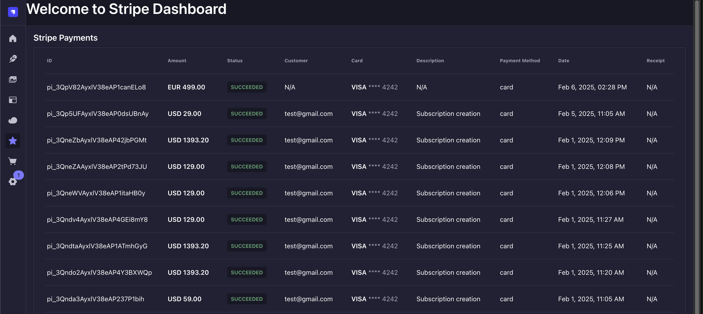

# Strapi Plugin - Stripe Dashboard

A **Strapi v5 plugin** that provides a dashboard to view your Stripe transactions. It offers a clean, modern interface built with the Strapi Design System to easily manage and inspect your payments and receipts.




---

## 🚀 Features

- **Latest Transactions:** View your most recent Stripe transactions at a glance.
- **Detailed Transaction Info:** Access detailed information including amount, status, and customer data.
- **Payment Details:** See card payment information and receipt tracking.
- **Modern UI:** Enjoy a clean and modern interface powered by the Strapi Design System.
- **Easy Integration:** Quickly install and configure the plugin to start tracking your Stripe activity.

---

## ⚙️ Installation

Install the plugin using either npm or yarn.

### Using npm

```bash
npm install strapi-plugin-stripe-dashboard
```
## 🔧 Configuration

1. Add your Stripe secret key to your environment variables:

```JS
STRIPE_SECRET_KEY=sk_test_...
```
2. Enable the plugin in your `config/plugins.js`:


```javascript
module.exports = ({ env }) => ({
'stripe-dashboard': {
enabled: true,
},
});
```

## 🎯 Usage

Once installed and configured, you'll see a "Stripe" STAR menu item in your Strapi admin panel. Click it to view your Stripe transactions.

## 🤝 Contributing

Feel free to fork and make a Pull Request to this plugin! All contributions are welcome.

## 📝 License

[MIT License](LICENSE)

## ✨ Author

PiotrKrosniak 